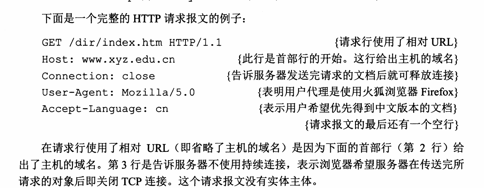

前端部分知识大总结
======
### 什么是 HTML ？
HTML 是用来描述网页的一种语言。

1. HTML 指的是超文本标记语言 (Hyper Text Markup Language)
2. HTML 不是一种编程语言，而是一种标记语言 (markup language)
3. 标记语言是一套标记标签 (markup tag)
4. HTML 使用标记标签来描述网页

### HTML 标签的相关属性有哪些？

1. HTML 标记标签通常被称为 HTML 标签 (HTML tag)。

2. HTML 标签是由尖括号包围的关键词，比如 `<html>`
3. HTML 标签通常是成对出现的，比如 `<b>` 和 `</b>`
4. 标签对中的第一个标签是开始标签，第二个标签是结束标签，开始和结束标签也被称为开放标签和闭合标签

### HTML 几种常见的基础标签

#### HTML 标题
HTML 标题（Heading）是通过 `<h1> - <h6>` 等标签进行定义的。

实例
```
<h1>This is a heading</h1>
<h2>This is a heading</h2>
<h3>This is a heading</h3>
```

#### HTML 段落
HTML 段落是通过 `<p>` 标签进行定义的。

实例
```
<p>This is a paragraph.</p>
<p>This is another paragraph.</p>
```

#### HTML 链接
HTML 链接是通过 `<a>` 标签进行定义的。

实例
```
<a href="http://www.w3school.com.cn">This is a link</a>
```

注释：在 href 属性中指定链接的地址。


#### HTML 图像
HTML 图像是通过 `` 标签进行定义的。

实例
```

```

注释：图像的名称和尺寸是以属性的形式提供的。
### HTML src 和 herf 的区别
`href` 是`Hypertext Reference`的简写，表示超文本引用，指向网络资源所在位置
`src`是`source`的简写，目的是要把文件下载到html页面中去。
### HTML`<div>` 和 `<span>`

可以通过 `<div>` 和 `<span>` 将 HTML 元素组合起来。

HTML 块元素
大多数 HTML 元素被定义为块级元素或内联元素。

编者注：“块级元素”译为 block level element，“内联元素”译为 inline element。

块级元素在浏览器显示时，通常会以新行来开始（和结束）。

例子：`<h1>, <p>, <ul>, <table>`

HTML 内联元素
内联元素在显示时通常不会以新行开始。

例子：`<b>, <td>, <a>, `

HTML `<div>` 元素
HTML `<div>` 元素是块级元素，它是可用于组合其他 HTML 元素的容器。

`<div>`元素没有特定的含义。除此之外，由于它属于块级元素，浏览器会在其前后显示折行。

如果与 CSS 一同使用，`<div>` 元素可用于对大的内容块设置样式属性。

`<div>` 元素的另一个常见的用途是文档布局。它取代了使用表格定义布局的老式方法。使用 `<table>` 元素进行文档布局不是表格的正确用法。`<table>` 元素的作用是显示表格化的数据。

HTML `<span>` 元素
HTML `<span>` 元素是内联元素，可用作文本的容器。

`<span>` 元素也没有特定的含义。

当与 CSS 一同使用时，`<span>` 元素可用于为部分文本设置样式属性。

### HTML 文本格式化

|标签	|描述|
|---|---|
|`<b>`	|定义粗体文本|
|`<big>`	|定义大号字|
|`<em>`	|定义着重文字|
|`<i>`	|定义斜体字|
|`<small>`|	定义小号字|
|`<strong>`|	定义加重语气|
|`<sub>`	|定义下标字|
|`<sup>`	|定义上标字|
|`<ins>`	|定义插入字|
|`<del>`	|定义删除字|

## 什么是 HTML5？
HTML5 是最新的 HTML 标准。

HTML5 是专门为承载丰富的 web 内容而设计的，并且无需额外插件。

HTML5 拥有新的语义、图形以及多媒体元素。

HTML5 提供的新元素和新的 API 简化了 web 应用程序的搭建。

HTML5 是跨平台的，被设计为在不同类型的硬件（PC、平板、手机、电视机等等）之上运行。

### HTML5 - 新特性

新的语义元素，比如 `<header>`, `<footer>`, `<article>`, and `<section>`。

新的表单控件，比如数字、日期、时间、日历和滑块。

强大的图像支持（借由 `<canvas>` 和 `<svg>`）

强大的多媒体支持（借由 `<video>` 和 `<audio>`）

强大的新 API，比如用本地存储取代 cookie

### HTML5 Canvas

canvas 元素用于在网页上绘制图形。

#### 什么是 Canvas？
HTML5 的 canvas 元素使用 JavaScript 在网页上绘制图像。

画布是一个矩形区域，您可以控制其每一像素。

canvas 拥有多种绘制路径、矩形、圆形、字符以及添加图像的方法。

# 计算机网络

# 计算机网络层次构成和每个层次的常用协议


URL - Uniform Resource Locator

URL指的是统一资源定位符（Uniform Resource Locator）。URL无非就是一个给定的独特资源在Web上的地址。理论上说，每个有效的URL都指向一个独特的资源。这个资源可以是一个HTML页面，一个CSS文档，一幅图像，等等。而在实际中，有一些例外，最常见的情况就是URL指向了不存在的或是被移动过的资源。由于通过URL呈现的资源和URL本身由Web服务器处理，因此web服务器的拥有者需要认真地维护资源以及与它关联的URL。

当您点击 HTML 页面中的某个链接时，对应的 `<a>`标签指向万维网上的一个地址。

统一资源定位器（URL）用于定位万维网上的文档（或其他数据）。

网址，比如 http://www.w3school.com.cn/html/index.asp，遵守以下的语法规则：

scheme://host.domain:port/path/filename

解释：

scheme - 定义因特网服务的类型。最常见的类型是 http


host - 定义域主机（http 的默认主机是 www）


domain - 定义因特网域名，比如 w3school.com.cn


:port - 定义主机上的端口号（http 的默认端口号是 80）


path - 定义服务器上的路径（如果省略，则文档必须位于网站的根目录中）


filename - 定义文档/资源的名称


URL 的英文全称是 Uniform Resource Locator，中文也译为“统一资源定位符”。

URL Schemes
以下是其中一些最流行的 scheme：

|Scheme	|访问	|用于...|
|---|---|---|
|http	|超文本传输协议|	以 http:// 开头的普通网页。不加密。|
|https|	安全超文本传输协议|	安全网页。加密所有信息交换。|
|ftp	|文件传输协议|	用于将文件下载或上传至网站。|
|file|	 	|您计算机上的文件。|

### HTTP

#### HTTP 方法：GET 对比 POST

两种最常用的 HTTP 方法是：GET 和 POST。

#### 什么是 HTTP？
超文本传输协议（HTTP）的设计目的是保证客户机与服务器之间的通信。

HTTP 的工作方式是客户机与服务器之间的请求-应答协议。

web 浏览器可能是客户端，而计算机上的网络应用程序也可能作为服务器端。

举例：客户端（浏览器）向服务器提交 HTTP 请求；服务器向客户端返回响应。响应包含关于请求的状态信息以及可能被请求的内容。

#### 两种 HTTP 请求方法：GET 和 POST
在客户机和服务器之间进行请求-响应时，两种最常被用到的方法是：GET 和 POST。

*GET* - 从指定的资源请求数据。
*POST* - 向指定的资源提交要被处理的数据
#### GET 方法
请注意，查询字符串（名称/值对）是在 GET 请求的 URL 中发送的：

```/test/demo_form.asp?name1=value1&name2=value2```
有关 GET 请求的其他一些注释：

-GET 请求可被缓存
-GET 请求保留在浏览器历史记录中
-GET 请求可被收藏为书签
-GET 请求不应在处理敏感数据时使用
-GET 请求有长度限制
-GET 请求只应当用于取回数据
#### POST 方法
请注意，查询字符串（名称/值对）是在 POST 请求的 HTTP 消息主体中发送的：

POST /test/demo_form.asp HTTP/1.1
Host: w3schools.com
name1=value1&name2=value2
有关 POST 请求的其他一些注释：

POST 请求不会被缓存
POST 请求不会保留在浏览器历史记录中
POST 不能被收藏为书签
POST 请求对数据长度没有要求
#### 比较 GET 与 POST
下面的表格比较了两种 HTTP 方法：GET 和 POST。

|比较项目|GET|	POST|
|---|---|---|
|后退按钮和刷新|	无害|	数据会被重新提交（浏览器应该告知用户数据会被重新提交）。|
|书签	|可收藏为书签	|不可收藏为书签|
|缓存	|能被缓存	|不能缓存|
|编码类型|	application/x-www-form-urlencoded	|application/x-www-form-urlencoded 或 multipart/form-data。为二进制数据使用多重编码。|
|历史	|参数保留在浏览器历史中。	|参数不会保存在浏览器历史中。|
|对数据长度的限制	|是的。当发送数据时，GET 方法向 URL 添加数据；URL 的长度是受限制的（URL 的最大长度是 2048 个字符）。	|无限制。|
|对数据类型的限制	|只允许 ASCII 字符。	|没有限制。也允许二进制数据。|
|安全性|与 POST 相比，GET 的安全性较差，因为所发送的数据是 URL 的一部分。在发送密码或其他敏感信息时绝不要使用 GET ！|


POST 比 GET 更安全，因为参数不会被保存在浏览器历史或 web 服务器日志中。
可见性	数据在 URL 中对所有人都是可见的。	数据不会显示在 URL 中。
其他 HTTP 请求方法
下面的表格列出了其他一些 HTTP 请求方法：

|方法	|描述|
|---|---|
|HEAD|	与 GET 相同，但只返回 HTTP 报头，不返回文档主体。|
|PUT|	上传指定的 URI 表示。|
|DELETE|	删除指定资源。|
|OPTIONS|	返回服务器支持的 HTTP 方法。|
|CONNECT|	把请求连接转换到透明的 TCP/IP 通道。|

# WebScoket 基础知识

## 一句话概括
**WebSocket 是一种网络传输协议，可在单个TCP连接上进行全双工通信，位于OSI模型的应用层**


**WebSocket 使得客户端和服务器之间的数据交换变得更加简单，允许服务端主动向客户端推送数据。在 WebSocket API 中，浏览器和服务器只需要完成一次握手，两者之间就可以创建持久性的连接，并进行双向数据传输**


**WebSocket 是 HTML5 开始提供的一种浏览器与服务器进行全双工通讯的网络技术，属于应用层协议。它基于TCP传输协议，并复用HTTP的握手通道**

众所周知，Web应用的通信过程通常是`客户端`通过`浏览器`发出一个`请求`，`服务器端`接收`请求`后进行处理并返回结果给`客户端`，客户端浏览器将信息呈现。这种机制对于信息变化不是特别频繁的应用可以良好支撑，但对于`实时要求高、海量并发`的应用来说显得捉襟见肘，尤其在当前业界移动互联网蓬勃发展的趋势下，高并发与用户实时响应是 Web 应用经常面临的问题，比如金融证券的实时信息、Web 导航应用中的地理位置获取、社交网络的实时消息推送等。传统的请求-响应模式的 Web 开发在处理此类业务场景时，通常采用实时通讯方案。比如常见的轮询方案，其原理简单易懂，就是客户端以一定的时间间隔频繁请求的方式向服务器发送请求，来保持客户端和服务器端的数据同步。其问题也很明显：当客户端以固定频率向服务器端发送请求时，服务器端的数据可能并没有更新，带来很多无谓请求，浪费带宽，效率低下。


基于 Flash，AdobeFlash 通过自己的 Socket 实现完成数据交换，再利用 Flash 暴露出相应的接口给 JavaScript 调用，从而达到实时传输目的。此方式比轮询要高效，且因为 Flash 安装率高，应用场景广泛。然而，移动互联网终端上 Flash 的支持并不好：IOS 系统中无法支持 Flash，Android 虽然支持 Flash 但实际的使用效果差强人意，且对移动设备的硬件配置要求较高。2012年 Adobe 官方宣布不再支持 Android4.1+系统，宣告了 Flash 在移动终端上的死亡。传统的Web模式在处理高并发及实时性需求的时候，会遇到难以逾越的瓶颈，需要一种高效节能的双向通信机制来保证数据的实时传输。

在此背景下，基于 HTML5 规范的、有 Web TCP 之称的 WebSocket 应运而生。早期 HTML5 并没有形成业界统一的规范，各个浏览器和应用服务器厂商有着各异的类似实现，如IBM的MQTT、Comet开源框架等。直到2014年，HTML5终于尘埃落地，正式落实为实际标准规范，各个应用服务器及浏览器厂商逐步开始统一，在 JavaEE7 中也实现了WebSocket协议。至此无论是客户端还是服务端的 WebSocket 都已完备。用户可以查阅 HTML5 规范，熟悉新的 HTML 协议规范及 WebSocket 支持。


## WebSocket 的优点
1. 支持双向通信，实时性更强。
2. 更好的二进制支持。
3. 较少的控制开销。连接创建后，ws客户端、服务端进行数据交换时，协议控制的数据包头部较小。在不包含头部的情况下，服务端到客户端的包头只有2~10字节（取决于数据包长度），客户端到服务端的的话，需要加上额外的4字节的掩码。而HTTP协议每次通信都需要携带完整的头部。
4. 支持扩展。ws协议定义了扩展，用户可以扩展协议，或者实现自定义的子协议。（比如支持自定义压缩算法等）


## WebSocket 机制

以下简要介绍一下WebSocket的原理及运行机制。WebSocket 是 HTML5 下一种新的协议。它实现了浏览器与服务器全双工通信，能更好的节省服务器资源和带宽并达到实时通讯的目的。它与HTTP一样通过已建立的TCP连接来传输数据，但是它和HTTP最大不同是：WebSocket是一种双向通信协议。在建立连接后，WebSocket服务器端和客户端都能主动向对方发送或接收数据，就像Socket一样；WebSocket需要像TCP一样，先建立连接，连接成功后才能相互通信。

传统HTTP客户端与服务器请求响应模式如下图所示：


WebSocket模式客户端与服务器请求响应模式如下图：


上图对比可以看出，相对于传统HTTP每次请求-应答都需要客户端与服务端建立连接的模式，WebSocket是类似Socket的TCP长连接通讯模式。一旦WebSocket连接建立后，后续数据都以帧序列的形式传输。在客户端断开WebSocket连接或Server端中断连接前，不需要客户端和服务端重新发起连接请求。在海量并发及客户端与服务器交互负载流量大的情况下，极大的节省了网络带宽资源的消耗，有明显的性能优势，且客户端发送和接受消息是在同一个持久连接上发起，实时性优势明显。

相比HTTP长连接，WebSocket有以下特点：是**真正的全双工方式**，建立连接后客户端与服务器端是完全平等的，可以互相主动请求。而HTTP长连接基于HTTP，是传统的客户端对服务器发起请求的模式。HTTP长连接中，每次数据交换除了真正的数据部分外，服务器和客户端还要大量交换HTTP header，信息交换效率很低。Websocket协议通过第一个request建立了TCP连接之后，之后交换的数据都不需要发送 HTTP header就能交换数据，这显然和原有的HTTP协议有区别所以它需要对服务器和客户端都进行升级才能实现（主流浏览器都已支持HTML5）。此外还有 multiplexing、不同的URL可以复用同一个WebSocket连接等功能。这些都是HTTP长连接不能做到的。下面再通过客户端和服务端交互的报文对比 WebSocket 通讯与传统HTTP的不同点：在客户端，new WebSocket 实例化一个新的 WebSocket 客户端对象，请求类似 ws://yourdomain:port/path 的服务端WebSocket URL，客户端 WebSocket 对象会自动解析并识别为 WebSocket 请求，并连接服务端端口，执行双方握手过程，客户端发送数据格式类似：
```
GET /webfin/websocket/ HTTP/1.1
Host: localhost
Upgrade: websocket
Connection: Upgrade
Sec-WebSocket-Key: xqBt3ImNzJbYqRINxEFlkg==
Origin: http://localhost:8080
Sec-WebSocket-Version: 13
```
可以看到，客户端发起的 WebSocket 连接报文类似传统 HTTP 报文

Upgrade：websocket参数值表明这是WebSocket类型请求，Sec-WebSocket-Key是WebSocket客户端发送的一个 base64编码的密文，要求服务端必须返回一个对应加密的Sec-WebSocket-Accept应答，否则客户端会抛出Error during WebSocket handshake错误，并关闭连接。服务端收到报文后返回的数据格式类似：
```
HTTP/1.1 101 Switching Protocols
Upgrade: websocket
Connection: Upgrade
Sec-WebSocket-Accept: K7DJLdLooIwIG/MOpvWFB3y3FE8=
```

# 状态码的描述

HTTP 响应状态代码指示特定 HTTP 请求是否已成功完成。响应分为五类：

# 信息响应(100–199)

# 成功响应(200–299)

# 重定向(300–399)

# 客户端错误(400–499)

# 服务器错误 (500–599)

# 状态代码由 section 10 of RFC 2616定义

## 信息响应
**`100 Continue`**
这个临时响应表明，迄今为止的所有内容都是可行的，客户端应该继续请求，如果已经完成，则忽略它。

## 成功响应
**`200 OK`**
请求成功。成功的含义取决于HTTP方法：

1. GET：资源已被提取并在消息正文中传输。
2. HEAD：实体标头位于消息正文中。
3. POST：描述动作结果的资源在消息体中传输。
4. TRACE：消息正文包含服务器收到的请求消息

## 重定向

`301 Moved Permanently`


被请求的资源已永久移动到新位置，并且将来任何对此资源的引用都应该使用本响应返回的若干个 URI 之一。如果可能，拥有链接编辑功能的客户端应当自动把请求的地址修改为从服务器反馈回来的地址。除非额外指定，否则这个响应也是可缓存的。


`302 Found`


请求的资源现在临时从不同的 URI 响应请求。由于这样的重定向是临时的，客户端应当继续向原有地址发送以后的请求。只有在Cache-Control或Expires中进行了指定的情况下，这个响应才是可缓存的。


`303 See Other`


对应当前请求的响应可以在另一个 URI 上被找到，而且客户端应当采用 GET 的方式访问那个资源。这个方法的存在主要是为了允许由脚本激活的POST请求输出重定向到一个新的资源。
但用户代理不能更改所使用的 HTTP 方法：如果在第一个请求中使用 POST，则必须在第二个请求中使用 POST。
## 客户端响应
`400 Bad Request`


1、语义有误，当前请求无法被服务器理解。除非进行修改，否则客户端不应该重复提交这个请求。
2、请求参数有误。

**`403 Forbidden`**


服务器已经理解请求，但是拒绝执行它。与 401 响应不同的是，身份验证并不能提供任何帮助，而且这个请求也不应该被重复提交。如果这不是一个 HEAD 请求，而且服务器希望能够讲清楚为何请求不能被执行，那么就应该在实体内描述拒绝的原因。当然服务器也可以返回一个 404 响应，假如它不希望让客户端获得任何信息。

**`404 Not Found`**


请求失败，请求所希望得到的资源未被在服务器上发现。没有信息能够告诉用户这个状况到底是暂时的还是永久的。假如服务器知道情况的话，应当使用410状态码来告知旧资源因为某些内部的配置机制问题，已经永久的不可用，而且没有任何可以跳转的地址。404这个状态码被广泛应用于当服务器不想揭示到底为何请求被拒绝或者没有其他适合的响应可用的情况下。

## 服务端响应
`500 Internal Server Error`


服务器遇到了不知道如何处理的情况。

*`502 Bad Gateway`*


此错误响应表明服务器作为网关需要得到一个处理这个请求的响应，但是得到一个错误的响应。


# HTTP 有两类报文
1. 请求报文
2. 响应报文

# HTTP 请求报文和响应报文都是由三个部分组成的：
1. 开始行
2. 首部行
3. 实体主体


其中首部行 ：用来说明浏览器、服务器或报文主体的一些信息。首部可以有好几行，也可以不使用

**每一个首部行都有首部字段名和它的值，每一行在结束的地方都要回车和换行，整个首部行结束时，还有一空行将首部行和后面的实体主体分开**

# HTTP 首部字段是什么？

HTTP 首部字段（英语：HTTP header fields）是指在超文本传输协议（HTTP）的请求和响应报文中的首部行部分。它们定义了一个超文本传输协议事务中的操作参数。HTTP头部字段可以自己根据需要定义，因此可能在 Web 服务器和浏览器上发现非标准的首部字段。

# 首部字段的基本格式
以明文的字符串格式传输，是以冒号分隔的键名与键值对，以回车(CR)加换行(LF)符号序列结尾
# 首部字段的类型
HTTP 首部字段根据实际用途被分为以下 4 种类型：

`通用首部字段`(英语：General Header Fields)
`请求首部字段`(英语：Request Header Fields)
`响应首部字段`(英语：Response Header Fields)
`实体首部字段`(英语：Entity Header Fields)

### 常见的请求首部字段：
|Header|解释|示例|
|---|---|---|
|Accept	|指定客户端能够接收的内容类型	|Accept: text/plain, text/html|
|Accept-Charset|	浏览器可以接受的字符编码集。|	Accept-Charset: iso-8859-5/utf-8|
|Accept-Encoding|	指定浏览器可以支持的web服务器返回内容压缩编码类型。 |Accept-Encoding: compress, gzip|

### 常见的回应首部字段：
|Header|解释|示例|
|---|---|---|
|Accept-Ranges|	表明服务器是否支持指定范围请求及哪种类型的分段请求|	Accept-Ranges: bytes|
|Age	|从原始服务器到代理缓存形成的估算时间（以秒计，非负）|	Age: 12|
|Allow	|对某网络资源的有效的请求行为，不允许则返回405	|Allow: GET, HEAD|
|Content-Language|内容所使用的语言|Content-Language: da|
|Content-Length|回应消息体的长度，以字节为单位|Content-Length:348|

## 很著名的 Cookie
#### 创建Cookie
当服务器收到 HTTP 请求时，服务器可以在响应头里面添加一个 {{HTTPHeader("Set-Cookie")}}选项。浏览器收到响应后通常会保存下 Cookie，之后对该服务器每一次请求中都通过 {{HTTPHeader("Cookie")}} 请求头部将 Cookie 信息发送给服务器。另外，Cookie 的过期时间、域、路径、有效期、适用站点都可以根据需要来指定。

Set-Cookie 响应头部和 Cookie 请求头部

```
HTTP/1.0 200 OK
Content-type: text/html
Set-Cookie: yummy_cookie=choco
Set-Cookie: tasty_cookie=strawberry
```

博客园参考链接：https://www.cnblogs.com/onepixel/articles/7545959.html
谢希仁教科书参考插图：